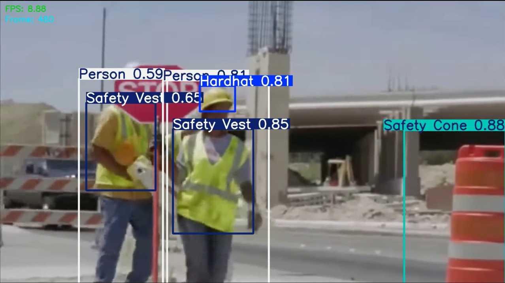
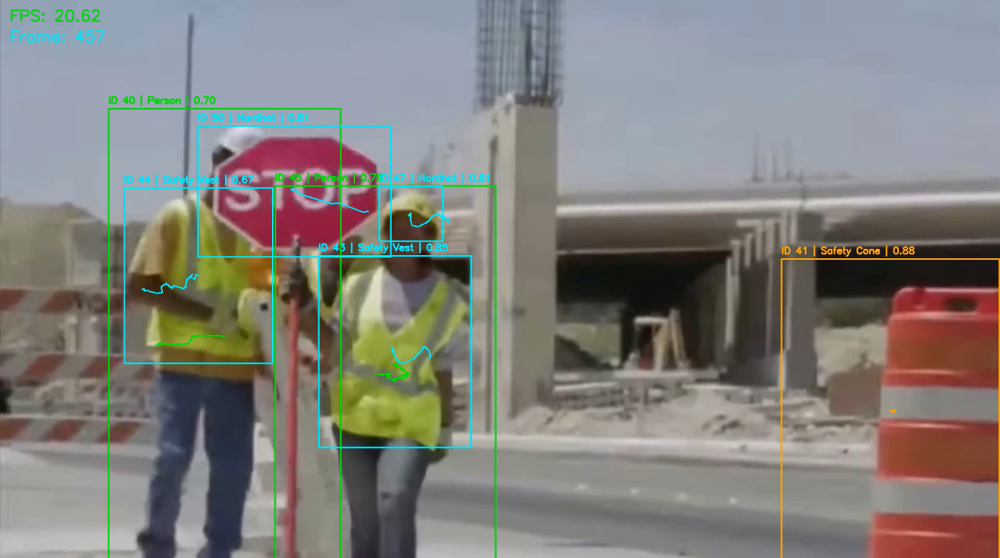
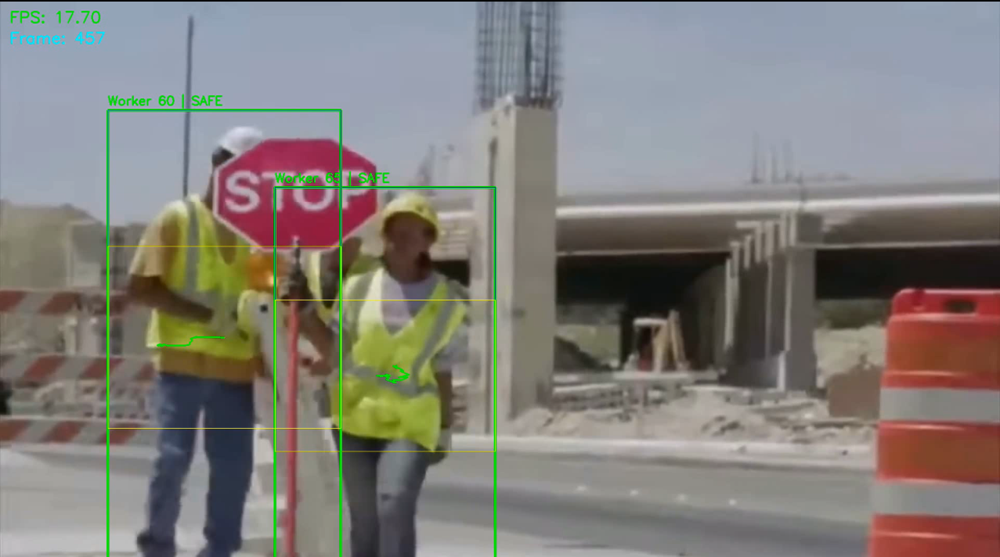
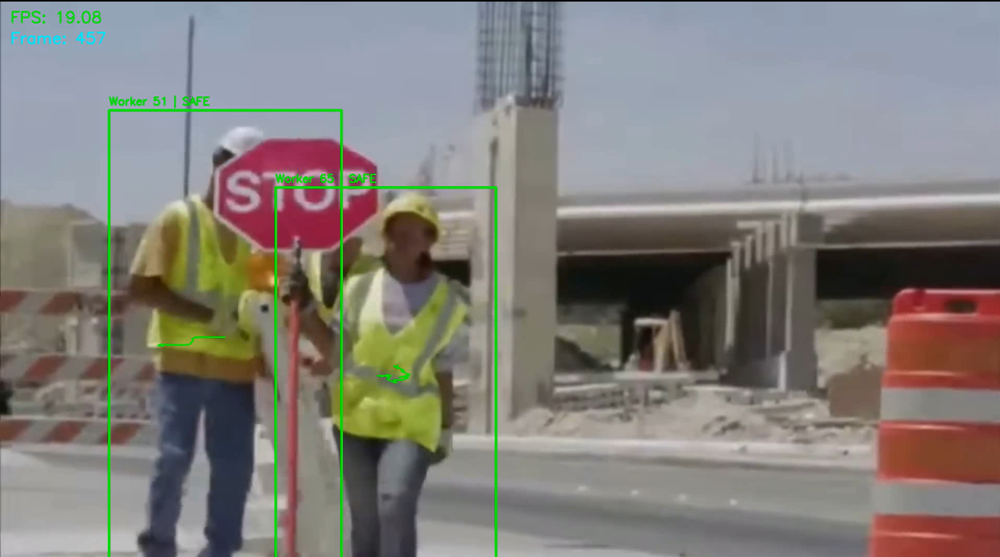
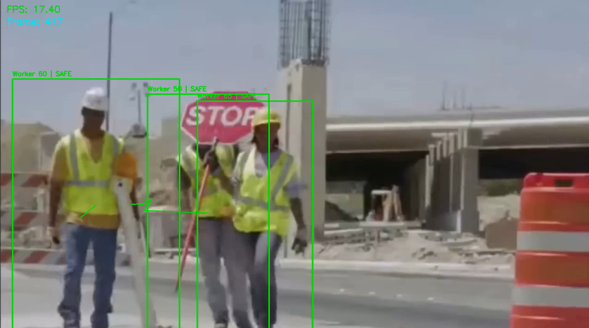

<h1 align="center">ForgeGuard</h1>

<p align="center">
AI-Powered Industrial Safety Intelligence System
</p>

<p align="center">


</p>

---

## Overview

ForgeGuard is an advanced computer vision system designed for real-time industrial safety monitoring in construction and hazardous work environments.

The system combines:

- PPE Detection
- Multi-Object Tracking
- Compliance Intelligence
- Hazard-Zone Monitoring
- Temporal Safety Violation Analysis

into a unified AI surveillance pipeline.

---

<p align="center">
  
</p>

---

# Key Features

| Feature | Description |
|---|---|
| Real-Time Detection | YOLO11-based PPE detection |
| Worker Tracking | Persistent identity tracking using ByteTrack |
| Compliance Intelligence | PPE compliance reasoning system |
| Hazard Detection | Machinery proximity monitoring |
| Temporal Monitoring | Persistent safety violation analysis |
| Modular Architecture | Production-style repository structure |
| Training Pipeline | End-to-end YOLO11 training workflow |
| Analytics | Evaluation metrics and visualization support |

---

# System Pipeline

```text
Dataset Cleaning
        ↓
Annotation Validation
        ↓
YOLO11 Training
        ↓
Real-Time Inference
        ↓
Multi-Object Tracking
        ↓
PPE Compliance Intelligence
        ↓
Hazard-Zone Detection
        ↓
Temporal Violation Monitoring
```

---

# Project Structure

```text
ForgeGuard/
│
├── assets/
│
├── configs/
│
├── datasets/
│   ├── raw/
│   └── processed/
│
├── models/
│   ├── pretrained/
│   └── trained/
│
├── notebooks/
│
├── outputs/
│   ├── confusion_matrix/
│   ├── metrics/
│   ├── plots/
│   └── predictions/
│
├── src/
│   ├── analytics/
│   ├── compliance/
│   ├── hazard/
│   ├── inference/
│   ├── temporal/
│   ├── tracking/
│   ├── training/
│   └── utils/
│
├── videos/
│   ├── input/
│   └── output/
│
├── requirements.txt
└── README.md
```

---

# Technologies Used

| Category | Technologies |
|---|---|
| Deep Learning | PyTorch, Ultralytics YOLO11 |
| Computer Vision | OpenCV |
| Tracking | ByteTrack |
| Data Processing | NumPy, Pandas |
| Visualization | Matplotlib |
| Development | Jupyter Notebook |

---

# Dataset

The project uses a construction-site PPE detection dataset containing:

- Hardhat
- Safety Vest
- Mask
- Person
- Machinery
- Vehicle
- Safety Cone
- PPE violation classes

Dataset preprocessing and annotation validation pipelines were implemented before model training.

> Note: Dataset images and labels are intentionally excluded from the repository due to size constraints.

---

# Model Training

The model was trained using YOLO11m with:

| Parameter | Value |
|---|---|
| Image Size | 960 |
| Optimizer | AdamW |
| Epochs | 100 |
| Scheduler | Cosine Learning Rate |
| Augmentations | Mosaic, MixUp, Copy-Paste |
| Mixed Precision | Enabled |

---

# Training Performance

The system achieved strong performance across PPE detection classes using the YOLO11 architecture.

### Included Metrics

- Precision-Recall Curve
- F1 Curve
- Confusion Matrix
- mAP50
- mAP50-95
- Training Loss Visualization

---

# Output Demonstrations

## Real-Time Detection

<p align="center">
  
</p>

---

## Multi-Object Tracking

<p align="center">
  
</p>

---

## PPE Compliance Intelligence

<p align="center">
  
</p>

---

## Hazard-Zone Monitoring

<p align="center">
  
</p>

---

## Temporal Violation Monitoring

<p align="center">
  
</p>

---

# Key Modules

## 1. Real-Time Detection
Performs frame-wise PPE and object detection using YOLO11.

---

## 2. Multi-Object Tracking
Uses ByteTrack for persistent worker identity tracking across frames.

---

## 3. PPE Compliance Intelligence
Analyzes whether tracked workers satisfy PPE requirements.

---

## 4. Hazard-Zone Intelligence
Detects workers entering dangerous proximity zones near machinery and vehicles.

---

## 5. Temporal Violation Monitoring
Tracks prolonged PPE violations across time and raises persistent alerts.

---

# Installation

## Clone Repository

```bash
git clone https://github.com/vanshpatel-017/ForgeGuard.git
```

---

## Navigate to Project

```bash
cd ForgeGuard
```

---

## Install Dependencies

```bash
pip install -r requirements.txt
```

---

# Usage

## Run Video Inference

```bash
python src/inference/video_inference.py
```

---

## Run Multi-Object Tracking

```bash
python src/tracking/tracker.py
```

---

## Run PPE Compliance System

```bash
python src/compliance/ppe_compliance.py
```

---

## Run Hazard Intelligence

```bash
python src/hazard/hazard_detection.py
```

---

## Run Temporal Monitoring

```bash
python src/temporal/temporal_violation.py
```

---

# Research and Development Workflow

The repository maintains both:

| Component | Purpose |
|---|---|
| `notebooks/` | Experimental and research workflow |
| `src/` | Production-style modular implementation |

This separation enables both reproducibility and maintainability.

---

# Repository Highlights

- Structured modular architecture
- End-to-end computer vision pipeline
- Real-time industrial safety intelligence
- Advanced temporal reasoning system
- Production-oriented repository organization
- Multi-stage AI surveillance workflow

---

# Future Improvements

- Real-time alert notification system
- Edge-device deployment
- RTSP camera integration
- Web dashboard
- Incident logging system
- Zone-based geofencing
- Multi-camera monitoring
- Audio alarm integration

---

# Author

## Vansh Patel

<p align="left">

<a href="https://github.com/vanshpatel-017">
  
</a>

</p>

---

# License

This project is licensed under the MIT License.